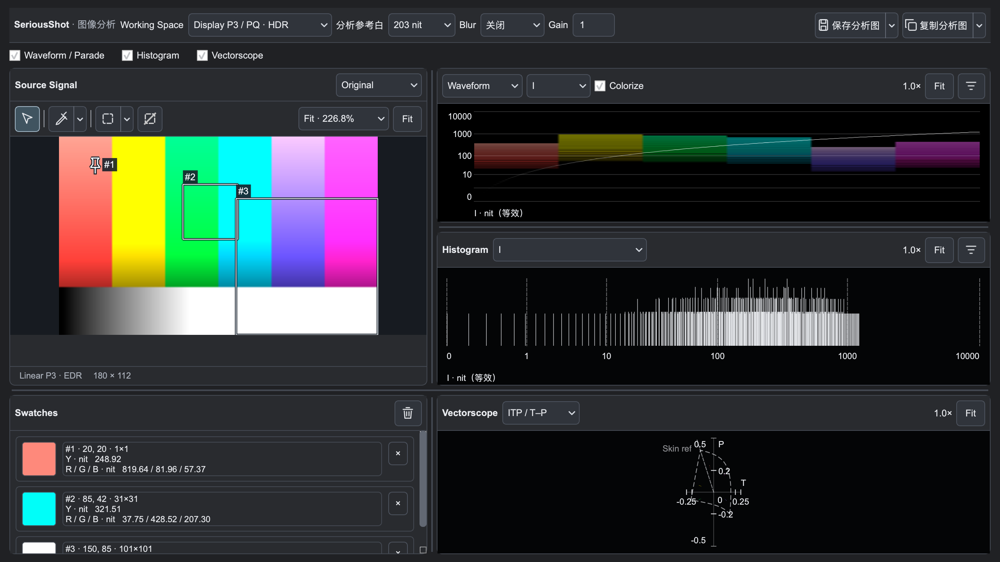
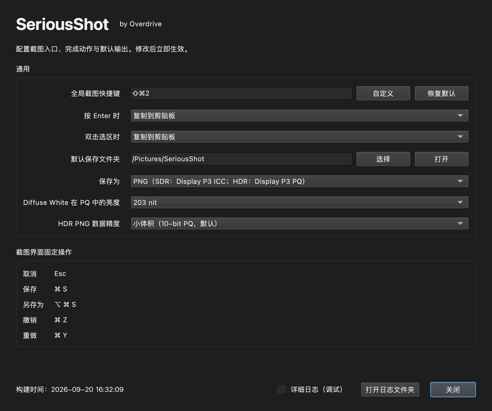

# SeriousShot · 严肃截图

最后更新：2026-09-21 08:55:45 CST

**在 HDR 与广色域屏幕上截图，直接标注，保留颜色；需要时，再深入分析。**

SeriousShot 是面向 macOS 与 Windows 11 的截图工具。不只是把画面存下来，还关心高光是否保留、颜色如何解释，以及图片发出去以后能否被正确显示。

- **选区里直接标注**：画圈、框选、箭头、文字，完成后复制或保存，不必先生成文件再打开编辑器。
- **HDR 与 SDR 都认真处理**：保留 HDR 信息；SDR 输出同样携带与像素匹配的 ICC 色彩配置。
- **两种输出选择**：PNG 用于保留细节；Ultra HDR JPEG 通过 ISO 21496-1 增益图兼顾 HDR 呈现与普通 JPEG 查看。
- **截图也能做分析**：波形、直方图、矢量示波器、吸管、区域 Mask 和 False Color 集中在一个工作台。

## 截图、标注、分享，一次完成

启动截图后选择区域，在当前选区中添加矩形、圆形／椭圆、箭头或文字；标注可以调整，支持撤销与重做。最后选择复制、保存或另存为，也可以直接进入分析器。

与 macOS 自带的“[截完后点击缩略图，再进入标记](https://support.apple.com/en-euro/guide/mac-mini/apdbc4019fdf/mac)”流程相比，SeriousShot 把标注放在截图选区阶段：**画完再交付，而不是先截完再编辑。**

在 Windows 上，普通截图工具与 Xbox Game Bar 的 HDR 捕获是不同的使用场景。SeriousShot 把桌面选区、可编辑标注和 HDR 文件输出放在同一流程中，减少捕获之后另外编辑、转换格式的步骤。

## 不只截到 HDR，也把颜色带出去

### PNG：保留细节，明确颜色含义

保存为 16-bit RGB PNG，按截图内容选择 SDR 或 HDR 输出：

- **SDR**：Display P3 像素与匹配的 ICC 配置一同保存。尤其在 Windows 11 的 SDR 截图场景，避免把没有 ICC 的截图交给查看器猜测色彩空间；不是只把显示器配置文件原样塞进去。
- **HDR**：使用 Display P3 / PQ，并写入色彩与亮度信息，供支持 HDR PNG 的软件解释。无需先压成 SDR 再分享高光内容。

### Ultra HDR JPEG：一张图片，兼顾 SDR 与 HDR 查看

HDR 内容保存为带 **ISO 21496-1 + XMP 增益图**的 JPEG：普通 JPEG 查看器读取 SDR 基础图，支持增益图的查看器恢复 HDR。相比依赖特定 HDR 格式查看器的工作流，更便于向不同设备分享。

纯 SDR 内容则直接保存为带 ICC 的普通 JPEG，不额外附加没有用途的 HDR 增益图。

HDR 的最终显示取决于查看器、操作系统和屏幕；PNG 的 HDR 呈现需要查看器支持 PQ，Ultra HDR 的 HDR 呈现需要支持增益图。选择 JPEG 的优势是：不支持 HDR 的接收端仍有普通 SDR 图可看。

## 图像分析工作台

*macOS 实际界面，使用合成色阶示例；网页中的界面图仅展示布局，不用于判断屏幕的 HDR 亮度。*

- **Waveform／Parade**：观察亮度与各通道在画面中的分布，添加参考线，检查高光与暗部。
- **Histogram**：查看亮度、RGB、色相分布，支持 Adobe Style 的 SDR／HDR 分段显示。
- **Vectorscope**：查看 Y′CbCr、Lab 或 ITP 色平面中的分布及当前工作色域轮廓。
- **吸管与 Swatches**：读取像素或区域平均值，保留采样色块，并在图表中定位均值与区域分布。
- **Mask 与 False Color**：限定分析区域，或用伪色辅助观察亮度；切换伪色不会改变其他图表的分析数据。

支持 Display P3／sRGB／BT.2020 对应的四种分析工作空间、100／203 nit 分析参考白、Blur 与显示 Gain。面板可以拖动分隔线调整布局，图表可缩放和平移；当前分析界面也可以保存或复制为一张图。

**分析器目前以 macOS 版本提供，Windows 分析器接入仍在后续计划中。**

## 设置界面

配置全局截图快捷键、按 Enter／双击选区时的完成动作、默认保存位置，以及 PNG 或 JPEG 输出。PNG 可选择 HDR 精度与参考白；选择 JPEG 时显示对应质量选项。设置修改后立即生效。

## 开始使用

1. 启动应用，设置截图快捷键与默认输出格式；macOS 首次使用需授予屏幕录制权限。
2. 按快捷键选择截图区域，在选区中直接添加标注。
3. 点击复制、保存或另存为；需要检查画面时，点击分析按钮进入工作台。

## 系统支持

| 系统 | 最低版本 | 支持与限制 |
|---|---|---|
| macOS | **15.5** | 截图、标注与分析器；**macOS 15.5 的 HDR 截图仅支持内置屏幕，不支持外接 HDR 屏幕** |
| Windows | **Windows 11** | SDR／HDR 截图、标注与文件输出；分析器尚未接入，不支持 Windows 10 |

其他 macOS 版本与外接显示器组合仍需按实际环境确认，不能仅凭达到最低版本就视为外接 HDR 可用。HDR 预览需要支持 HDR 的屏幕与系统设置；SDR 截图不要求 HDR 显示器。

## 开发与反馈

从源码构建请看[开发构建说明](docs/BUILDING.md)。问题反馈请附操作系统版本、内置／外接显示器、HDR 开关状态与复现步骤；分享截图前请移除私人信息。

项目主许可证尚未指定；第三方组件许可见 [THIRD_PARTY_NOTICES.md](THIRD_PARTY_NOTICES.md)。
