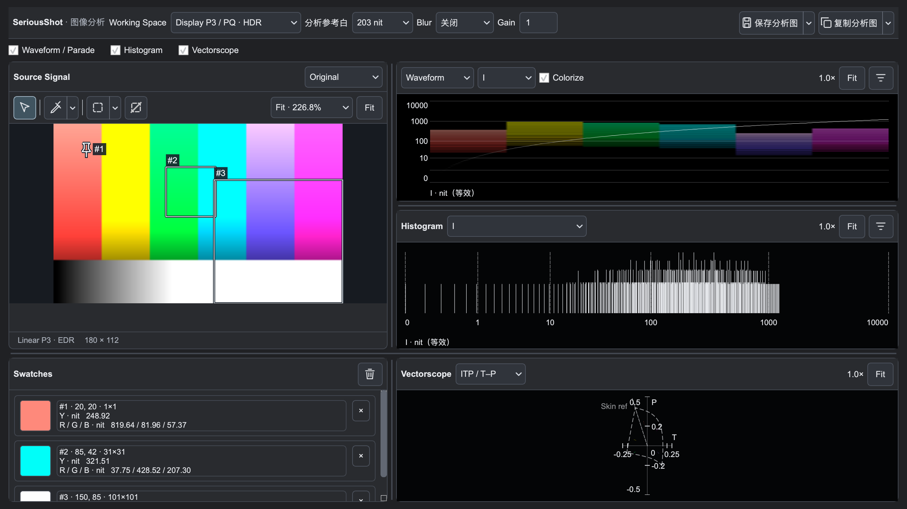
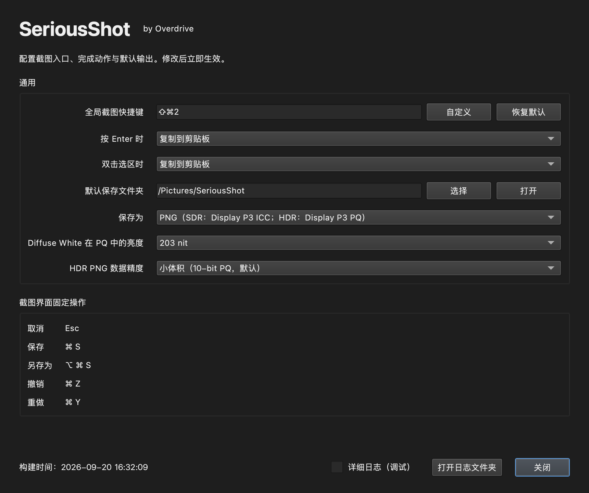

# SeriousShot · 严肃截图

最后更新：2026-10-08 12:20:25 CST

**在 HDR 与广色域屏幕上截图，直接标注，保留颜色；需要时，再深入分析。**

SeriousShot 是面向 macOS 与 Windows 的截图工具。不只是把像素值存下来，还关心 **HDR 能否正常截图、色彩管理是否正确，以及图片发出去后能否被正确显示**。

- **选区里直接标注**：画圈、框选、箭头、文字，完成后复制或保存，不必先生成文件再打开编辑器。
- **HDR 与 SDR 都认真处理**：保留 HDR 信息；SDR 输出同样携带与像素匹配的 ICC 色彩配置。
- **两种输出选择**：PNG 用于保留细节；Ultra HDR JPEG 通过 ISO 21496-1 增益图兼顾 HDR 呈现与普通 JPEG 查看。
- **截图也能做分析**：波形、直方图、矢量示波器、吸管、区域 Mask 和 False Color 集中在一个工作台。

## 为什么选择 SeriousShot

### 相比 macOS 自带截图

- **分享时多一种选择**：macOS 26 在受支持机型上提供 [HEIF 格式的 HDR 截图](https://support.apple.com/en-au/102646)。SeriousShot 提供 PNG 和 Ultra HDR JPEG，便于接入常见的图片查看、编辑与分享流程；Ultra HDR JPEG 在不支持增益图的查看器中仍可作为普通 SDR JPEG 打开。
- **截图时直接写写画画**：不必先截完、点击缩略图再进入标记。在选区中画圈、加箭头、写文字，确认后一次复制或保存。
- **截图后直接分析**：进入波形、直方图和矢量示波器工作台，检查亮度、颜色与局部采样。

### 相比 Windows 截图工具与 Xbox Game Bar

- **HDR 文件更便于流通**：对于使用 JXR（JPEG XR）的 Windows HDR 捕获流程，SeriousShot 可直接输出 PNG 或 Ultra HDR JPEG，减少分享前另行转换的步骤。微软的 [HDR 捕获工具文档](https://learn.microsoft.com/en-us/xbox/gdk/docs/tools/tools-pc/commandlinetools/gr-wdcapture?view=gdk-2604)列出了 JXR 输出；普通 Windows 截图工具也能保存 PNG／JPEG，区别不只是扩展名，而是文件是否保留 HDR、是否正确声明颜色，以及接收端如何显示它。
- **比 Game Bar 的捕获流程多一步就地标注**：在桌面选区内直接画圈、加箭头和文字，把截图、标注、输出合在一起。
- **SDR 也输出标准色彩空间**：对于直接保存显示缓冲区像素、缺少 ICC，或依赖显示器专属 ICC 的传统截图流程，SeriousShot 在 Windows 11 上将像素转换到标准 Display P3，并嵌入匹配的矩阵／曲线型 ICC（matrix-shaper profile）。图片的颜色解释不再依赖原显示器的专属配置，也更便于支持标准 ICC 的软件处理。这里包含实际像素转换，不是只替换 ICC 标签。

HDR 呈现仍取决于查看器、系统和屏幕的支持；通用文件格式并不意味着所有软件都能显示 HDR。[0.1.3 Release](https://github.com/OverDriveHuang/SeriousShot/releases/tag/v0.1.3) 提供 macOS arm64 DMG 与 Windows x64 ZIP，改善因精度误差导致的 HDR／SDR 误判。Windows 补充包对应的源码提交与归档链接见 Release 说明。

## 截图、标注、分享，一次完成

启动截图后选择区域，在当前选区中添加矩形、圆形／椭圆、箭头或文字；标注可以调整，支持撤销与重做。最后选择复制、保存或另存为，也可以直接进入分析器。

## SDR 与 HDR 都有色彩管理

### PNG：保留细节，明确颜色含义

保存为 16-bit RGB PNG，按截图内容选择 SDR 或 HDR 输出：

- **SDR**：Display P3 像素与匹配的 ICC 配置一同保存，让支持色彩管理的查看器正确解释颜色。
- **HDR**：使用 Display P3 / PQ，并写入色彩与亮度信息，供支持 HDR PNG 的软件解释。无需先压成 SDR 再分享高光内容。

### Ultra HDR JPEG：一张图片，兼顾 SDR 与 HDR 查看

HDR 内容保存为带 **ISO 21496-1 + XMP 增益图**的 JPEG：普通 JPEG 查看器读取 SDR 基础图，支持增益图的查看器恢复 HDR。相比依赖特定 HDR 格式查看器的工作流，更便于向不同设备分享。

纯 SDR 内容则直接保存为带 ICC 的普通 JPEG，不额外附加没有用途的 HDR 增益图。

HDR 的最终显示取决于查看器、操作系统和屏幕；PNG 的 HDR 呈现需要查看器支持 PQ，Ultra HDR 的 HDR 呈现需要支持增益图。选择 JPEG 的优势是：不支持 HDR 的接收端仍有普通 SDR 图可看。

## 图像分析工作台

*macOS 实际界面，使用合成色阶示例；网页中的界面图仅展示布局，不用于判断屏幕的 HDR 亮度。*

- **Waveform／Parade**：观察亮度与各通道在画面中的分布，添加参考线，检查高光与暗部。
- **Histogram**：查看亮度、RGB、色相分布，支持 Adobe Style 的 SDR／HDR 分段显示。
- **Vectorscope**：查看 Y′CbCr、Lab 或 ITP 色平面中的分布及当前工作色域轮廓。
- **吸管与 Swatches**：读取像素或区域平均值，保留采样色块，并在图表中定位均值与区域分布。
- **Mask 与 False Color**：限定分析区域，或用伪色辅助观察亮度；切换伪色不会改变其他图表的分析数据。

支持 Display P3／sRGB／BT.2020 对应的四种分析工作空间、100／203 nit 分析参考白、Blur 与显示 Gain。面板可以拖动分隔线调整布局，图表可缩放和平移；当前分析界面也可以保存或复制为一张图。

macOS 与 Windows 共用分析工作流；Windows 版本使用原生 GPU 后端。Vectorscope 支持鼠标左键拖动平移。

## 设置界面

配置全局截图快捷键、按 Enter／双击选区时的完成动作、默认保存位置，以及 PNG 或 JPEG 输出。PNG 可选择 HDR 精度与参考白；选择 JPEG 时显示对应质量选项。Windows 设置页还提供“Windows 10 截图亮度兼容”选项；设置修改后立即生效。

## 开始使用

### Windows 解压运行与更新

下载 [0.1.3 的 Windows x64 ZIP](https://github.com/OverDriveHuang/SeriousShot/releases/tag/v0.1.3)，完整解压到一个可写目录，再从解压后的目录运行 SeriousShot；不要直接在压缩包中启动。更新时先退出正在运行的旧版，再解压新版并从新版目录启动，避免继续运行旧副本。首次运行后按需设置截图快捷键、输出格式与保存位置。Windows 10 的亮度兼容选项见下方系统支持说明。

### macOS 安装与首次使用

1. 打开下载的 **DMG**，把 **SeriousShot.app** 图标拖到 **Applications（应用程序）** 文件夹。
2. 从“应用程序”启动 SeriousShot，设置截图快捷键与默认输出格式。不要直接从 DMG 中运行。
3. 第一次按截图快捷键时，按提示进入 **系统设置 → 隐私与安全性 → 屏幕与系统音频录制**（部分系统版本称“屏幕录制”），允许 SeriousShot；如果系统要求退出并重新打开应用，按提示操作。
4. 再按截图快捷键，选择区域并直接添加标注；点击复制、保存或另存为，需要检查画面时进入分析器。

### 从旧版升级：替换应用与恢复录屏权限

**先退出旧版，再把新版拖到 Applications 中，选择替换。** 如果旧版装在其他位置，请移除旧的 SeriousShot.app，只保留准备使用的新版，避免启动到旧副本；在 Applications 中直接替换即可，不需要另外保留旧版应用。

当前分发版本没有 Apple Developer ID 分发签名。升级后可能再次要求录屏权限，即使系统设置里 SeriousShot 已显示为允许。**遇到这种情况时**：

1. 启动替换后的新版，按一次截图快捷键，触发权限提示。
2. 进入上述录屏权限设置，**选中 SeriousShot 条目，点击列表下方的“−”删除这条旧授权记录**；不是只把开关关掉。
3. 返回新版，再按一次截图快捷键，让系统重新请求授权。
4. 再进入录屏权限设置，手动打开 SeriousShot 的权限。
5. 系统询问是否退出并重新打开应用时，确认重启 **SeriousShot**；之后再次截图。

如果升级后截图正常，无需删除授权记录。以上操作只针对 SeriousShot，不需要重置其他应用的权限。

## 系统支持

| 系统 | 最低版本 | 支持与限制 |
|---|---|---|
| macOS | **15.5** | 截图、标注与分析器；已测试的显示器组合与已知问题见下表 |
| Windows | **Windows 11；有限兼容 Windows 10 21H2** | 截图、标注、分析器与文件输出；Windows 10 的兼容设置与实测范围见下表 |

### 用户实测范围与已知问题

以下是项目维护者本人在具体设备上的截图试用反馈。“未发现问题”表示其认可该环境下的实际效果，不代表所有设备、驱动、查看器或功能均已通过完整测试。

| 系统与设备 | 测试条件 | 实际反馈 |
|---|---|---|
| Windows 10 目标机（已有设备记录为 21H2，本轮未重新确认版本） | 同时启用 scRGB gain = **0.5** 与“**HDR 捕获不使用 SDRWhiteLevel 归一化**”；分别测试 HDR 和 Legacy 广色域模式 | 两种模式均未发现问题 |
| Windows 11 本机 26H2 | 分别测试 ACM 开启、Legacy、HDR 开启三种模式 | 三种模式均未发现问题 |
| Windows 11 此前版本（维护者记忆为 25H2，版本号未复核） | 历史试用分别测试 ACM 开启、Legacy、HDR 开启三种模式 | 三种模式均未发现问题 |
| macOS 15.5，内置非 XDR 屏幕 | 最大 EDR 约 **2** | 未发现问题 |
| macOS 15.5，已测试的一台外接第三方 HDR 显示器 | 外接 HDR 截图 | **截图过曝，已知问题** |
| macOS 26 与 macOS 27，内置及外接 XDR 屏幕 | 均使用 **Reference Mode（参考模式）** | 已测试组合均未发现问题 |
| 上述条件以外的系统版本、显示器或模式组合 | **未测试** | 效果尚未确认 |

macOS 26／27 的反馈限于上述 Reference Mode 条件，其他模式仍未测试。HDR 预览需要支持 HDR 的屏幕与系统设置；SDR 截图不要求 HDR 显示器。

Windows 颜色处理区分传统 SDR（Legacy）、自动色彩管理（ACM）和 HDR 模式。关闭 HDR 时按 SDR 输出；传统 SDR 路径依据显示器 ICC 做实际颜色转换。无法识别显示模式时使用 Legacy 回退，不支持无边框捕获的系统可使用带边框捕获。

**部分 Windows 10 版本可能出现截图亮度异常（偏亮、偏暗或发浅）。** 既往在部分 Windows 10 21H2 系统上观察到捕获线性值约为预期两倍；上表目标机已在同时启用两个兼容子项后获得维护者认可。遇到这一现象时，可尝试开启设置中的“Windows 10 截图亮度兼容”。此兼容设置默认关闭：总开关全选时同时启用 scRGB gain 与“HDR 捕获不使用 SDRWhiteLevel 归一化”，只启用其中一项时显示半选。两个子项可独立调整；开启总开关时默认同时勾选两个子项。scRGB gain 可编辑，预设值为 0.5，只有启用该子项后才应用。并非所有 Windows 10 都需要开启兼容设置；已测试的 Windows 11 环境未见上述现象。Windows 10 的实际效果仍取决于系统版本、显示器和驱动。

## 开发与反馈

从源码构建请看[开发构建说明](docs/BUILDING.md)。问题反馈请附操作系统版本、内置／外接显示器、HDR 开关状态与复现步骤；分享截图前请移除私人信息。

项目主许可证尚未指定；第三方组件许可见 [THIRD_PARTY_NOTICES.md](THIRD_PARTY_NOTICES.md)。
